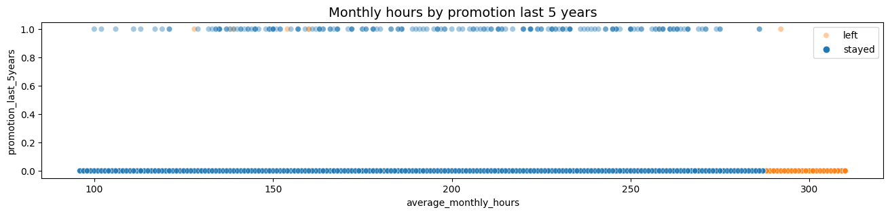

# **Optimizing Employee Retention for Salifort Motors**
# Overview
`Salifort Motors`, a fictional alternative energy vehicle manufacturer, has taken a proactive step by seeking data-driven insights to enhance employee satisfaction levels within the company. The Human Resources (HR) department has collected extensive data from employees, creating an invaluable resource that, when harnessed effectively, can guide strategic initiatives to mitigate turnover. The goal of this capstone project is, to conduct a thorough `analysis` of the HR data collected by Salifort Motors and develop a robust `predictive` model capable of foreseeing whether an employee is likely to `leave the company`. The `PACE` framework was used to structure and complete this project. - **P**lan - **A**nalyze - **C**onstruct - **E**xecute.

# Business Understanding
The HR department, recognizing the impact of high turnover on operational stability and costs, seeks to leverage data-driven insights to proactively enhance employee satisfaction and retention. The project aims to discover data-driven insights to inform strategic decisions, improve the working environment, and ultimately `reduce employee turnover`. By viewing data as a strategic asset, Salifort Motors aims to optimize HR practices, placing employees at the center of organizational success.

# Data Understanding
The dataset was collected by the HR department, capturing a wide range of information pertaining to employees' professional activities, evaluations, projects, tenure, salaries, and overall satisfaction levels. Understanding the significance of each variable and the relationship between them were discoved in `Exploratory data analysis`. The scatter plot below shows the relationship between average_monthly_hours and promotion_last_5years, which was used to examine whether employees who worked very long hours were promoted in the last five years. The plot shows that very few employees who worked the most hours were promoted and all of the employees who left were working the longest hours.

A correlation heatmap was also constructed to confirm that the number of projects, monthly hours, and evaluation scores all had some positive correlation with each other, and whether an employee leaves was negatively correlated with their satisfaction level.

# Modeling and Evaluation
In the comparative analysis between logistic regression and tree-based models (random forest and xgboost) for predicting employee turnover, XGBoost emerged as the most effective model based on its superior performance on the validation dataset. The `XGBoost` model achieved AUC of 93.9%, precision of 89.3%, recall of 89.9%, f1-score of 89.6%, and accuracy of 96.5%, on the test set. In the final model, `last_evaluation`, `number_project`, `tenure`, `salary_low` and `overworked` had the highest importance, in that order. These variables are most helpful in predicting the outcome variable, **left**.

# Conclusion
Type II errors `false negative` were more common in the final predictive model. For this use case, this was more desirable, because it's better for a driver to be pleasantly surprised by a generous tip when they weren't expecting one than to be disappointed by a low tip when they were expecting a generous one. The model has the potential to assist taxi drivers in anticipating whether they will receive generous tips, but it does not provide a detailed understanding of how each variable affects the exact tip amount. In the future, enhancing the model with additional data related to a rider's historical tipping patterns could prove advantageous in addressing the stakeholder's business challenges.

----
----

# Installation
- Clone this repo to your computer. `git clone` <[repository_url](https://github.com/farahdahir/Automatidata)>
- Navigate to the project directory: using `cd Automatidata`
- Install the required libraries from the `requirements.txt` file using pip: `pip install -r requirements.txt`

# Reviewing the Project
The project follows has 3 files and 2 folders. The `automatidata.ipynb` is the main notebook for the project. It is divided into sections aigning with the PACE frame-work Plan, Analyse, Construct and Execute. For the Construct stage some code cells are commented out, where the predictive models are fitted to save you time. This does not affect the overral work flow of the project, since the models were fitted and saved as pickle files.

The project also includes an images folder and data folder. Remember all datasets are stored in the data folder along with the pickled models.
